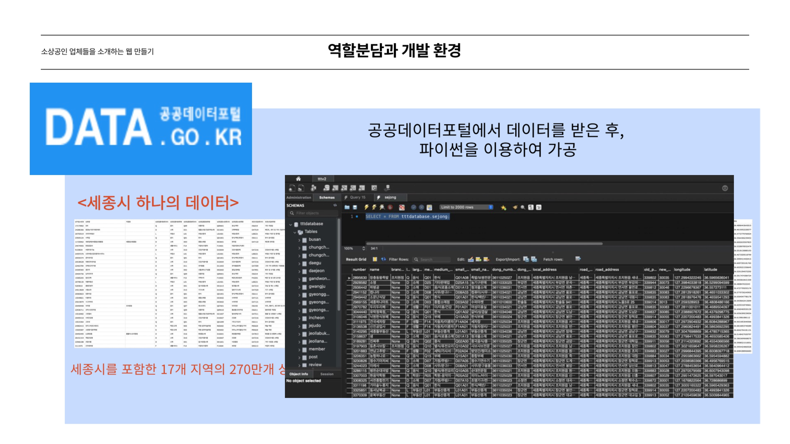

# TasteTheTrip
전국 소상공인 사이트 프로젝트 api

실행 결과
프론트 배포 url: http://54.180.13.188/
api 배포 url: http://43.200.25.231:8080/

|Method|URI|Description|비회원 접근 권한|JSON 변수 명|parameter|
|---|---|---|---|---|---|
|GET|/|메인화면|O|-|-|
|POST|/auth/signup|이용자 회원가입|O|name, email, password|-|
|POST|/auth/signup-business|사장님 회원가입|O|name, email, password|-|
|POST|/auth/login|로그인|O|username, password|-|
|GET|/mypage|마이페이지|X|-|-|
|POST|/posts|자유게시판-글 작성|X|title, content|-|
|GET|/posts|자유게시판-글 목록 조회|X|-|page(optional), size(optional), title(optional), content(optional), writtenBy(optional)|
|GET|/posts/{postId}|자유게시판-글 세부 조회|X|-|{postId}|
|PATCH|/posts/{postId}|자유게시판-글 수정|X, 작성자 외 수정 불가|title, content|{postId}|
|DELETE|/posts/{postId}|자유게시판-글 삭제|X, 작성자 외 삭제 불가|-|{postId}|
|GET|/review|홍보게시판-글 목록 조회|X|title, content, writtenBy|-|
|POST|/review|홍보게시판-글 작성|X, Member.ROLE != CEO 작성 불가|title, content, images[List]|-|
|GET|/review/{reviewId}|홍보게시판-글 세부 조회|X|-|{reviewId}|
|PATCH|/review/{reviewId}|자유게시판-글 수정|X, 작성자 외 수정 불가|title, content|{reviewId}|
|DELETE|/review/{reviewId}|자유게시판-글 삭제|X, 작성자 외 삭제 불가|-|{reviewId}|
|GET|/region/seoul/company|서울지역조회|X|-|smallCode, district, page(optional, default = 0), size(optional, default = 6)|
|GET|/region/busan/company|부산지역조회|X|-|smallCode, district, page(optional, default = 0), size(optional, default = 6)|
|GET|/region/chungcheongbukdo/company|충북지역조회|X|-|smallCode, district, page(optional, default = 0), size(optional, default = 6)|
|GET|/region/chungcheongnamdo/company|충남지역조회|X|-|smallCode, district, page(optional, default = 0), size(optional, default = 6)|
|GET|/region/daejeon/company|대전지역조회|X|-|smallCode, district, page(optional, default = 0), size(optional, default = 6)|
|GET|/region/gandwondo/company|강원도지역조회|X|-|smallCode, district, page(optional, default = 0), size(optional, default = 6)|
|GET|/region/gwangju/company|광주지역조회|X|-|smallCode, district, page(optional, default = 0), size(optional, default = 6)|
|GET|/region/gyeonggido/company|경기도지역조회|X|-|smallCode, district, page(optional, default = 0), size(optional, default = 6)|
|GET|/region/gyeongsangnamdo/company|경남지역조회|X|-|smallCode, district, page(optional, default = 0), size(optional, default = 6)|
|GET|/region/gyeongsangbukdo/company|경북지역조회|X|-|smallCode, district, page(optional, default = 0), size(optional, default = 6)|
|GET|/region/incheon/company|인천지역조회|X|-|smallCode, district, page(optional, default = 0), size(optional, default = 6)|
|GET|/region/jejudo/company|제주지역조회|X|-|smallCode, district, page(optional, default = 0), size(optional, default = 6)|
|GET|/region/jeollabukdo/company|전북지역조회|X|-|smallCode, district, page(optional, default = 0), size(optional, default = 6)|
|GET|/region/jeollanamdo/company|전남지역조회|X|-|smallCode, district, page(optional, default = 0), size(optional, default = 6)|
|GET|/region/sejong/company|세종지역조회|X|-|smallCode, district, page(optional, default = 0), size(optional, default = 6)|
|GET|/region/ulsan/company|울산지역조회|X|-|smallCode, district, page(optional, default = 0), size(optional, default = 6)|

